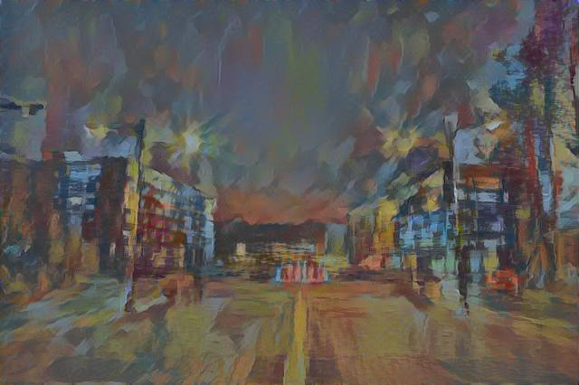
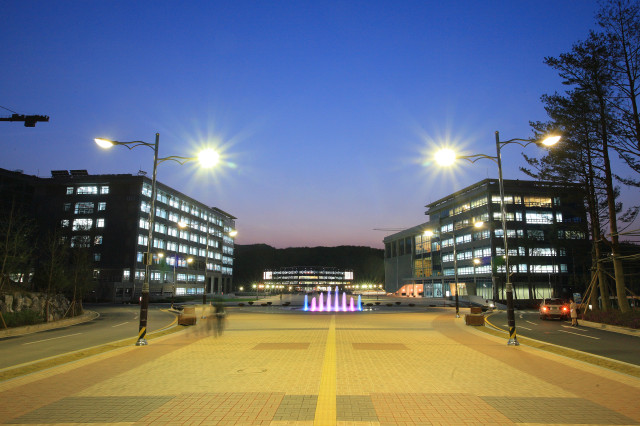
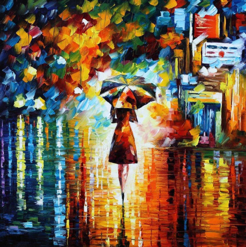

# neural style

An implementation of [neural style][paper] written in TensorFlow with IPythonNotebook.

## Examples

These were the input images used :

[Ulsan National Institute of Science and Technology][UNIST]

[RAIN PRINCESS by Leonid Afremov][rain]

<!--
[T.C. Fedro. (1969). Cubist 9][style]   
-->

## details

TensorFlow doesn't support [L-BFGS][l-bfgs] which is the original authors used.
So I use [Adam][adam]. This may require a little bit more hyperparameter tuning to get nice results.

you can get Pre-trained VGG network by

`wget http://www.vlfeat.org/matconvnet/models/beta16/imagenet-vgg-verydeep-19.mat`

## reference
[A Neural Algorithm of Artistic Style (Leon A. Gatys, et al.)][paper]

[Exploring the Neural Algorithm of Artistic Style (Yaroslav Nikulin, et al)][paper2]

[paper]: http://arxiv.org/pdf/1508.06576v2.pdf
[paper2]: http://arxiv.org/pdf/1602.07188v1.pdf
[style]: http://www.ebsqart.com/Art-Galleries/Contemporary-Cubism/43/Cubist-9/204218/
[rain]: https://afremov.com/RAIN-PRINCESS-Palette-knife-Oil-Painting-on-Canvas-by-Leonid-Afremov-Size-30-x30.html
[UNIST]: http://www.studyinkorea.go.kr/en/sub/college_info/college_info.do?ei_code=562240
[l-bfgs]: https://en.wikipedia.org/wiki/Limited-memory_BFGS
[adam]: http://arxiv.org/abs/1412.6980

