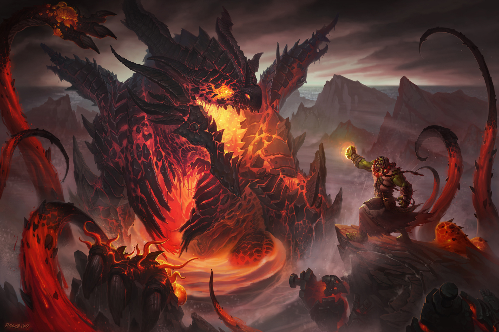

# neural style

An implementation of [neural style][paper] written in TensorFlow with IPythonNotebook.

## Example 1 - Initializing with content

These were the input images used (Deathwing, World of Warcraft):

## Example 2 - No Initializing

These were the input images used (Deathwing, World of Warcraft):

## details

TensorFlow doesn't support [L-BFGS][l-bfgs] which is the original authors used.
So I use [Adam][adam]. This may require a little bit more hyperparameter tuning to get nice results.

you can get Pre-trained VGG network by

`wget http://www.vlfeat.org/matconvnet/models/beta16/imagenet-vgg-verydeep-19.mat`

[paper]: http://arxiv.org/pdf/1508.06576v2.pdf
[l-bfgs]: https://en.wikipedia.org/wiki/Limited-memory_BFGS
[adam]: http://arxiv.org/abs/1412.6980
